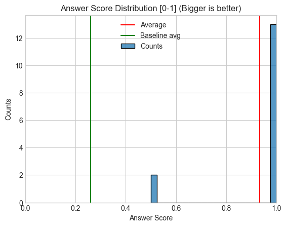
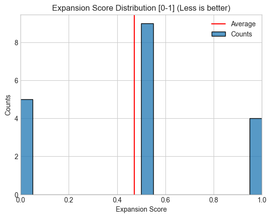
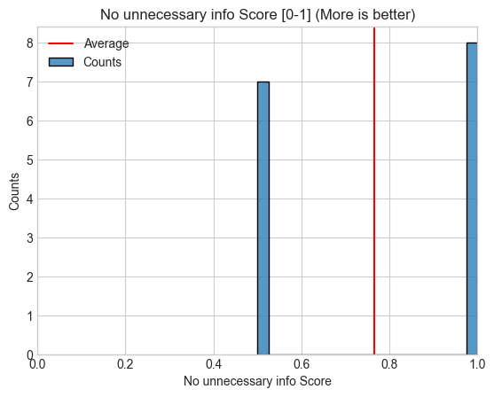

# Your latest documentation guide


(ChatGPT tried its best... Pretty impressive, imo)

# Executive Summary

LLMs struggle to access up-to-date AI documentation, especially for non-mainstream libraries. They invent non-existent syntax and produce wrong claims. The libraries evolve very fast, which creates an understandable difficulty for LLMs to keep up.

I developed an MCP (model context protocol) server that provides current information about rapidly evolving AI libraries. An MCP server is a local server uses a standard protocol to connect with various LLMs and AI coding tools, delivering relevant context when needed.

The solution implements semantic retrieval that either feeds directly into foundation models via MCP or routes to specialized agents. The design tries to optimize token efficiency and offers optional evaluation and tracing capabilities.

In addition to that I implemented a separate Retrieval and QnA agent that improves user query, evaluates them for validity or answers follow-up questions. The agent is expandable and offers more finetuned behavior than an MCP server.

I evaluated the Agent end-to-end (every step) and found out that compared to the Baseline (ChatGPT with web search) it performs significantly better: ChatGPT answer relevance and fullness has score 0.26[0-1] (human eval), and the Agent  0.83 (human eval). As the main end user of the system I confirm much better UX than LLMs with no context.


## How to use
- You will need Python 3.12.
- Install the requirements `pip install -r requirement.txt` and `pip install -r dev_requirements.txt` (for ipynb support).
- rename `config.json.template` into `config.json` and edit it
- Current repo is ready to run inference with `python -m gradio_simple` if you provide your open ai api key in `config.json`
- To re-run the pipeline from scratch with HF embeddings, delete files in `retrieved_data` and run `data_preparation.ipynb`
- To integrate the MCP server with your provider, follow your provider instructions.

## Table of content:
1. Dataset Sourcing:
 - Identify and select a free, open dataset relevant to NLP or text analysis.
 - Provide a brief justification for the chosen dataset and its relevance to the task.
2. Problem Definition:
 - Clearly define the problem you intend to solve using the chosen dataset.
 - Explain why this problem is significant and what impact solving it might have.
3. Approach and Pipeline:
 - Outline your approach to solving the problem.
 - Describe the tools, libraries, and frameworks you plan to use.
 - Detail your pipeline, including data preprocessing, feature engineering, model building, and evaluation.
4. Implementation:
 - Implement your pipeline in a Jupyter notebook.
 - Ensure that your code is well-documented and includes explanations for each step.
 - Visualize and explain your results.
5. Evaluation:
 - Evaluate the performance of your model(s) using appropriate metrics.
 - Discuss the strengths and limitations of your approach.
6. Recommendations:
 - Offer recommendations for potential improvements or next steps.

# 1. and 2. Data sourcing & Problem definition

**Source** https://ai.pydantic.dev/

## Problem statement

A general piece of advice on "coding with LLMs" is to stick to languages, frameworks, and libraries known to LLMs. It's reasonable advice - you want to be as close to the training set as possible. However, the moment you begin flirting with AI Engineering, this valuable advice goes out the window. The reasons are:

- AI libraries (especially Langchain) are changing too fast. As a result, the 'training data' and whatever an LLM finds online is a weird mix of multiple versions and its own fantasy
- My favorite AI library (Pydantic AI) is not that well known, so LLMs are especially prone to hallucinations about it
- While Perplexity is generally more agreeable when searching for solutions related to AI Engineering (even for Langchain!), it would also be nice to ask questions in the same place where your actual coding context is (e.g., Cursor or Claude with GitHub integration)


## Solution and Impact
 - The most obvious solution (suggested even by PydanticAI themselves) is to write a vectordb-based MCP (Model Context Protocol) server and add it to Claude, Cursor, or whatever LLM-based application is closer to one's heart (https://modelcontextprotocol.io/examples)

    - Having an MCP server implemented, I as a PydanticAI user can get the latest documentation wherever I need it
    - The LLMs will stop proposing completely made-up hallucinations or claiming that Pydantic is not an AI library, which will accelerate my development speed a lot.
    - If I publish it on GitHub and share with other people, it can be used by others who want to leverage PydanticAI, which is fantastic
    - This represents a significant quality of life improvement for an AI Engineer. Well, for me for sure :)
 - In addition to the MCP server (which I already have integrated with my Claude), I also added a LangGraph implementation of the same logic. This is a rather suboptimal solution, since unlike an MCP server it will cost one their own tokens, but it offers a possibility to 
    1. Have some custom logic, if one wishes to 
    2. Ensure that the tool calls are what you want (Claude app misbehaves sometimes, for example) 
    3. Actually evaluate the generative part of this RAG solution. 
    4. Have a more visual and generally end-to-end presentation for this assignment


## Constraints
 - General constraints on the project could be summarized as: "Which actions can bring an actually useful outcome under the time constraints?" This led to the choice of the problem: while more ambitious projects addressing broader issues would be interesting, they typically require more extensive development time and face distribution challenges. A targeted MCP that directly improves my workflow (and potentially helps other developers) represents a more achievable and immediately useful goal.
 - Originally I also wanted to add Langchain/Graph/Smith documentation to the project, but there were several issues with that
   - the structure of their website is very different from PydanticAI, demanding a completely different approach to scraping, which is time consuming
   - documentation quality is poor and I often times found myself using source code as reference, which in this context will lead to an extra complexity of writing yet another parser for the source code
 - Evaluations done by a single person are a rather painful experience, so the result isn't what one would call 'statistically signficant'. But I tried to be as methodical as time allowed. See evaluation section

# 3. Approach and Pipeline

## Data exploration and analysis

PydanticAI (and Langchain) documentation is available publicly on their websites, which can be easily loaded using Langchain's `RecursiveUrlLoader`.

Since our goal is ultimately to build a RAG solution, we need to examine the data carefully. Because we cannot (and should not) feed the entire website content to an LLM, we must understand how to split the data into well-structured pieces, each ideally covering a complete concept without including unrelated information (chunking). The chunking strategy significantly affects the final results.

### Structure of data and chunking consideration

PydanticAI website offers multiple well-structured documents of various lengths. The documents heavily mix code and text. Additionally, every HTML page has a complete table of contents, which can potentially confuse the retrieval logic.
- Due to the significant variation in page lengths, I decided to split pages into chunks rather than treating each page as a single chunk
- Given the heavy mix of code and text and some inconsistency with headers, the most efficient approach for splitting was to use code blocks as natural boundaries. This made each piece of code its own chunk, with text between code blocks forming separate chunks. This approach required post-retrieval addition of neighboring chunks, since a text chunk like "here's markdown streaming example" might be found by a query about "streaming markdown," but the associated code example (see below) might show a low relevance score on its own. I chose this approach over more complex parsing because it offered a good balance between implementation time and retrieval quality.
```python
async with agent.run_stream(prompt, model=model) as result:
    async for message in result.stream():
        live.update(Markdown(message))
```
During evaluation, I discovered that many retrievals pointed to https://ai.pydantic.dev/llms-full.txt, which appears to be the website developers' attempt to make their content LLM-friendly. I explored using this as the sole source but identified two significant drawbacks:
- It didn't reference the original documentation sources, which limits the ability to verify information if a user desires to do so.
- There were inconsistencies in heading hierarchies (#, ##, ###), causing some chunks to be semantically misaligned with their content.


Here are some examples:
 - very long page: https://ai.pydantic.dev/agents/#introduction with many code blocks
 - very short page: https://ai.pydantic.dev/troubleshooting/#monitoring-httpx-requests with almost no code
 - notice the table of contents on the left
 - the whole website as a `.md` https://ai.pydantic.dev/llms-full.txt

## Tools

I chose Langchain/LangSmith/LangGraph as my primary toolkit since it's appears to be an industry standard, and thefore is likely familiar to the reader.
- LangGraph provides more flexibility and control compared to pre-built LangChain agents, allowing for customized agent orchestration
- LangSmith was the natural choice for tracing and evaluation given my LangGraph-based implementation

I also utilized MCP SDK for MCP server implementation (https://github.com/modelcontextprotocol/python-sdk).

For the user interface, I implemented Gradio to provide both inline and standalone interactivity, offering a clean and functional interface with minimal almost 0 overhead.

For vector storage, I selected FAISS:
- It handles the relatively small dataset efficiently and has straightforward integration.
- It also offers scalability options like index compression (IndexPQ), batch loading, and GPU acceleration if needed.
- However, for significantly larger datasets, a managed solution like Pinecone would be preferable due to its horizontal scaling and multi-tenancy capabilities. But this is not our case :)
- I opted against hybrid retrieval (combining keyword and vector search) as vector retrieval alone produced sufficient results, keeping the system's complexity manageable.

I implemented a graph overlay using NetworkX to enhance retrieval quality:
- This approach addresses the issue of related information being split across adjacent chunks
- The graph structure connects related chunks that might be separated by the chunking strategy
- This solution is more efficient than implementing complex parsing logic, since I have little web scraping experience.
- The approach is extensible -- for incorporating additional documentation sources like Langchain, it could be expanded to connect documentation with relevant source code

For system observability and evaluation, I used LangSmith:
- Latency is a big problem wih LLMs. It grows very quickly with every wrong (or right) decision. Comprehensive tracing helps to identify the issues.
- It enables monitoring of the non-deterministic behavior inherent to LLMs
- In a complex agent system, tracing each decision step is essential for effective debugging and performance optimization

For a complete list of dependencies, please refer to the [requirements.txt](https://github.com/eliza-guseva/documentation-mcp/blob/main/requirements.txt) file in the repository.

## Pipeline

My pipeline is 3 separate pipelines:
 1. "training" -- here I gather data, preprocess it, vectorize and store it as combination of vectordb and a graph.
 2. inference + observability -- this pipeline relies on already existing information and retrieves the data and optionally generates answers
 3. evaluation -- the easiest way to add evals, was to add an evaluator that uses traces produced at step 2 to evaluate the whole pipeline performance in a separate call


All the relevant choices (for the location of file, embeddings choice etc) can be recorded in `config.json` that can be produced from `config.json.template`. I chose it for secrets as well instead of `.env` because it might be easier for a potential user (who is not me) to find the config. Also, it seems to be typical choice for MCP servers. `.gitignore` is meant to protect users from accidental secret sharing

### "Training"

1. Scrape the website using Langchain's `RecursiveUrlLoader`
2. Preprocess the data with BeautifulSoup to extract meaningful content and structure
3. Split data into meaningful chunks
    - Split page content into separate code and text chunks
    - Split the comprehensive markdown file by headers to maintain context
4. Vectorize and store
    - During vectorization, each chunk receives a unique ID, content hash, and position reference to its original HTML location
    - The system supports both Hugging Face and OpenAI embeddings, configurable by users
5. Create and store a simple graph that connects related documents
    - The graph links chunks from the same document with weighted edges
    - Edge weights decay based on distance between chunks, prioritizing nearby content
    - The identification system created in step 4 enables efficient graph construction

This pipeline is designed to be re-run periodically to incorporate updates to the documentation (though scheduling is not yet implemented). It intelligently checks for content changes to avoid unnecessary processing and token usage. I'm considering implementing an asynchronous freshness check directly within the retrieval tool, which would be more efficient than separate scheduled runs.

### Inference

1. MCP Solution
   - User query is vectorized using the same embedding model from training
   - Semantic similarity is calculated between the query and documents in the vector database, retrieving the highest-scoring matches
   - The retrieved document collection is enriched via adjacent chunk pulling using the graph connections
   - These contextually relevant documents are served directly to an LLM-based application
   - The LLM application uses this as a tool, invoking it whenever additional context is needed
   - Can be found: https://github.com/eliza-guseva/documentation-mcp/blob/main/main_mcp.py

2. Agent Solution
   - User query is processed by an agent that evaluates if the query:
     1. Is irrelevant or unclear (requiring clarification)
     2. Can be answered based on conversation history alone
     3. Needs to be split into sub-queries or reformulated for clarity
     4. Can be used as is for retrieval
   - For cases 1 and 2, a response is generated directly without retrieval
   - For cases 3 and 4, the retrieval process (described in the MCP solution) is performed followed by a generation step
   - Can be found: https://github.com/eliza-guseva/documentation-mcp/blob/main/interface.ipynb

3. Observability
   - For the Agent Solution, all reasoning steps and decisions are captured using LangSmith Tracing
   - These traces are stored on the LangSmith platform and later used for performance evaluation and debugging
   - This visibility into the agent's decision-making process is invaluable for understanding why certain paths were taken and identifying areas for improvement
   - Tracing functions can be found: https://github.com/eliza-guseva/documentation-mcp/tree/main/evals


### Evaluation

See the evaluation section

# 4. Implementation


The implementation choices made here are based on usefulness and re-usability considerations. 
Structured code in a GitHub repo can be used by others, expanded by me to other usecases and generally easy to read.

I split the pipeline into 3 separate pipelines to separate the concerns and avoid accidental re-indexing of the whole db.

The pipelines can be found here:
- Data preparation: (from getting data to vectorization) https://github.com/eliza-guseva/documentation-mcp/blob/main/data_preparation.ipynb
- Interface: (inference/retriveal with an agent) https://github.com/eliza-guseva/documentation-mcp/blob/main/interface.ipynb
- Evaluation with Langsmith: https://github.com/eliza-guseva/documentation-mcp/blob/main/feedback_processor.py
    - Report produced by running these evals: https://docs.google.com/spreadsheets/d/1UVdCyk_IM7gUBIkGNNuE_k_zTZJCdUdls-KZzFupCNU/edit?usp=sharing

## Repository structure

- Data loading functions are in `data_collection`
- Chunking, vectorization, graph utils and retrieval functions are in `vectorizing_and_retrieval`
- Agent and generation logic is in `agent`
- Tracing functions are in `evals`
- Root contains:
    - `mcp_main.py` -- an MCP server that can be connected to supporting LLMS/providers
    - `feedback_processor.py` -- a script that runs evaluations after tracing has been done. To run: `python feedback_processor.py`
    - `config.json.template` -- template to produce `config.json`
    - `.gitignore`
    - `.env` <- needed to intearact with LangSmith. Since it is not necessary for MCP, I didn't include it into `config.json`
    - `gradio_simple.py` -- a standalone agent interface that can be run in the browser with `python -m gradio_simple`

# 5. Evaluation

I evaluated 4 main components of my system through a balanced approach that prioritizes practical insights over exhaustive metrics:

## Performance Summary

| Component | Metric | Result | Baseline | Improvement |
|-----------|--------|--------|----------|-------------|
| Retrieval Success | Success Rate | 93% (14/15) | NA | NA |
| Multi-Query Generation | Accuracy | 95% (19/20) | NA | NA |
| Bad Query Detection | False Positive Rate | 10% (2/20) | NA | NA |
| Answer Quality | Correctness & Completeness | 0.83 | 0.26 | 3.2x improvement |
| Hallucination | Unsupported Claims Score | 0.33 | NA | NA |
| Hallucinated syntaxis | Hallucinated Syntaxis Score | 0 | 0.5 | significant improvemnt |

>**Note, that Unsupported Claims Score = 0.5 means a minor and _reasonable_ inference based on the documentation.**

>**Hallucinated PydanticAI syntaxis** is the major problem with Baseline, where even if Web Search is used, PydanticAI sytaxis resembles more LangChain than PydanticAI (made up syntaxis) or PydanticAI is conflated with Pydantic and Pydantic+Langchain integration is implemented





## Disclaimer
>**I admit that the size of the query pool (20) doesn't allow for proper satstical analysis supported claims, however under the time limitations and project scope it demonstrates general tendencies of the system, and if expanded can yield proper evaluation results**


## Evaluation Methodology

### Retrieval
I designed a balanced evaluation approach that optimized for both rigor and efficiency. Initially exploring classical 'gold standard' retrieval metrics for retrieval (recall@k and precision@k) through query-chunk pair analysis, I quickly recognized the diminishing returns of this approach given the project's scope and timeline.

Rather than pursuing metrics that would require excessive manual labeling effort, I pivoted to a more holistic end-to-end evaluation methodology that directly assessed what matters most in a production system: whether the correct information is successfully retrieved and utilized in generating accurate responses.

My evaluation framework focused on three critical dimensions:
- Information presence: Verifying that answers to user queries exist within the documentation
- Information surfacing: Confirming that relevant information appears in final responses
- Query satisfaction: Assessing whether responses directly answer the original queries


 ### Multi-query generation
 - In the beginning of the process the Agent checks if a query is well-formed and if it perhaps needs to be modified or split into several queries
 - I evaluated it manually. **Out of 20 cases, 19 were processed correctly**

 ### Bad query catching
  - Generally this step works well and catches trully irrelevant queries. However **rarely (I saw it 2x out of 20 (10%)) it misfires**, by classifying a correct query as an irrelevant. It asks for clarification, so it's not a disaster, imo.

### Fact-based generation
First, I considered typical uses-cases and came up with 5 types of queries (see below). Then I generated a stratified (based on sources) set of queries to cover all the types. For every type I also generated a query that is either not supported by documentation or partially supported.

I used double human and LLM as Judge evaluation and custom prompts with 0/1 or 0/0.5/1 options since there seem to be signficant indications that simpler evaluation criteria confuse LLMs less. The papers and 'best practices' guides I saw mostly use 0/1. For example: https://www.nature.com/articles/s41467-025-58551-6, https://hamel.dev/blog/posts/field-guide/.  But I wanted to experiment a little with 0/0.5/1, which produced a good result, despite the original worry.

I used human and and an AI since every LLM eval requires meta-evaluation (one has to evaluate evaluators). Another reason is that in LLM evaluation it is crucial to understand your data perhaps even more than in classical DS, because even more than in classical DS we without thorugh evals can become victims of random unsupported by reality metrics. So manual evaluation is inevitable.

I deliberately employed a rigorous bottom-up evaluation methodology, beginning with exploratory spot-checking to identify the most relevant criteria for this specific application domain. Then I produced a comprehensive set of initial critearia. I evaluated against all of them manually and with LLM (https://docs.google.com/spreadsheets/d/1UVdCyk_IM7gUBIkGNNuE_k_zTZJCdUdls-KZzFupCNU/edit?usp=sharing)

The results were very satisfying. Though on a couple of occasions I had to tweak an agent or an evaluator prompt. Through this systematic evaluation process, I refined my initial criteria set based on empirical findings, aligning with established research on 'criteria drift' (https://arxiv.org/abs/2404.12272), where evaluation criteria naturally evolve through interaction with the data. This adaptive approach to criteria development represents a methodological strength, allowing for discovery of the most meaningful evaluation dimensions rather than relying solely on predetermined metrics that might miss application-specific nuances.


## Key Findings

1. **Retrieval System Robustness**: 93% success rate demonstrates strong retrieval capabilities without requiring perfect precision optimization.

2. **Query Processing Effectiveness**: The system correctly processes and improves 95% of queries, with only 10% false positives when identifying irrelevant queries (which prompt for clarification rather than failing).

3. **Significant Quality Improvement**: The agent achieves an 83% answer quality score (human) versus the baseline's 26%, representing a 3.2x improvement in correctness and completeness.

4. **Low hallucination**: Human evaluation hallucination score is 34%, with strong tendency to minor insignficant expansion that don't 'hallucinate' PydanticAI syntxis. The rate of PydanticAI syntaxis hallucination was 0.

5. **Methodoloy validation**: This short run revealed some weakness in the evaluation criteria which is aligned with 'criteria drift' concept. Most prominently indicating that for this particular system the most valuabel metrics are not generalized hallucination and contradiction scores, but rathe 'absence of hallucinated Pydantic-AI syntaxis'. Whil expansion into Pydantic-AI unrelated fields it's more of a strength than a weakness

Comprehensive evaluation data is available in this [detailed spreadsheet](https://docs.google.com/spreadsheets/d/1UVdCyk_IM7gUBIkGNNuE_k_zTZJCdUdls-KZzFupCNU/edit?usp=sharing).

---


## Appendix A: Query Type Coverage

The evaluation covered five distinct query types commonly encountered in software documentation contexts:

| Query Type | Description | Example | Answer quality rate |
|------------|-------------|---------|--------------|
| Factual | Seeking specific information | "What is an agent?" | 100% |
| Procedural | How to accomplish tasks | "How do I create an agent in Pydantic AI?" | 100% |
| Conceptual | Understanding principles | "How does Pydantic AI's partial validation work?" | 75% |
| Troubleshooting | Handling errors | "I get Validation error when streaming structured output" | 75% |
| Integration | Using with other frameworks | "How do I integrate Pydantic AI with FastAPI?" | 75% |


## Appendix B: Recent discovery

Today, after more or less finishing the project I went to a Cursor meetup where I discovered that Cursor implemented "Docs" feature, which appears to be doing what I did -- periodically indexing documentation and making it easily searchable.

I did a partial eval of their performance on some of the queries. The performance in terms of answer quality is much better than Baseline and comparable with my Agent, but I won't make any claims of statistical significance. It appears that the Cursor team did a better job than I on removing claim 'extensions'. For example, if asked about Flask integration (a question that made my system invent things), their system attempted internet search (meaning didn't try to invent things). So, some prompt engineering and maybe extra tools are due in my system

## Appendix C: Details of testing on a set of diverse query types 
For more details see https://docs.google.com/spreadsheets/d/1UVdCyk_IM7gUBIkGNNuE_k_zTZJCdUdls-KZzFupCNU/edit?usp=sharing

We considered several types of queries that are commonly present in software development context

### 1. Factual Queries

These seek specific information or facts from the documentation.

**Examples:**
- "What is an agent?"

**Modes of failure:**
 - noncritical
 - extra procedural info is produced (per prompt not specific enough instructions)

### 2. Procedural Queries

These ask how to accomplish specific tasks using the library.

**Examples:**
- "How do create an agent in Pydantic AI?"

**Modes of failure:**
 - system sometimes asks for clarification assuming a given process is not associated with PydanticAI
 - ocassional extra information, but not too much


### 3. Conceptual and Comparsion Queries

These seek understanding of concepts, principles, or architectural decisions.

**Examples:**
 - "How does Pydantic AI's partial validation work?"
 - "What is the difference between `BaseModlel` and `TypedDict`?"

**Modes of failure:**
 - Non-trivial questions are lost (if most of the information that is needed for resolution is in the chunks associated with other topics then the retrieval won't extract it.) Which is natural, given the nature of retrieval. A user might need to ask a more precise question.

### 4. Error/Troubleshooting Queries

These are about handling specific errors or debugging issues.

**Examples:**
 - "I get Validation error when streaming structured output"

**Modes of failure:**
 - These proved to be very robust. Looks good, but I would say in this case I need to be my own user, to provide true troubleshooting examples.

### 5. Integration Queries

These ask about using the library with other tools or frameworks.

**Examples for Pydantic AI:**
 - "How do I integrate Pydantic AI with FastAPI?"

**Modes of failure**
 - If information is partially present or information about something similar is present, will likely hallucinate the answer. For example PydanticAI documentation describes integration with FastAPI and generally integrations, but never mentions Flask. Getting that information AI comes up with Flask integration. Which is for me is a desired behavior, **as long as** it doesn't hallucinate about PydanticAI. An ideal solution would be to add a separate tool for that, that is allowed to make up an answer as long as it keeps PydanticAI syntaxis intact


 ### General Modes of failure
 - On 1 ocassion pure sematic search conflated LangGraph Agent with Agent Graph, retrievd incorrect info, which resulted in incorrect generation and incorrect AI Judge evaluation. 
 - The system overexplains (like most of foundaton models nowadays), which is annoying, but not critical
 - My retrieval design overfetches, which is an expected behavior and doesn't appear to damage generation. Just costs tokens. 4o tokens...


## Tradeoffs and limitations

- The bottom up approach (first look, determine criteria, evaluate, track criteria etc) is involved in terms of human effort. But I believe it allow us to evaluate the black boxes of LLMs much better
- It would be nice to make a better retrieval evaluation, with proper chunk <-> query matching, but this is even more costly
- Using AI as a judge might prove to be scalable long term, but requires extensive initial meta-evaluation and periodic checking for drifts
- Criteria drift is inevitable when we learn about the system. This should be accounted for when we make longitudal comparisons of performance

# 6. Recommendations

- At this point, I am personally quite happy with MCP part. My Claude works with it pretty well. 
- I think I would like to add 'lastest only Langchain/LangGraph' tool and 'Deprecated only' tool to it. This would be extremely helpful for my purposes, since with Langchain all the versions jumble together in an inexplicable mess
- Since Cursor has similar quality access to documentation, I don't need to use my MCP with it.
- I probably should write about my MCP somewhere, even though there are other MCPs like mine.
- Maybe I can try (for fun's sake) turn my agent into a more friendly coding assistant. Since now it is unreasonably strict with sources of information. Making it more flexible can make it actually useful.
- I also believe I should stop using LangSmith and switch to Logfire and a custom evaluation viewer/editor. LangSmith proved itself too cumbersome with the type of evaluation I am doing -- impossible to put human feedback next to AI feedback easily, loosing some of the scores in the interfaces, confusing id system. This exercise proved to me that writing (generating rather) a custom case-specific viewer/editor is a worthy endeavor.
- I believe that using 0 and 1 evals with stricter criteria of what is 0 and what is 1 is much better idea for the future. The intermediate scale of 0, 0.5, 1 was indeed (as guides suggested) more confusing than helpful. But I felt I had to try to deviate from best practices, given a certain freedom of this assessment :)
- Looking forward to build something else. I think this little project +- exhausted itself.


(This is sligtly disturbing... Though still kinda neat)


